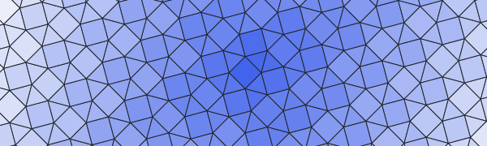

<p align="center">
  
</p>

<h2 align="center" style="margin: 0">ANTWERP</h2>
<h5 align="center" style="margin: 0">Application for Nets and Tessellations With Edge-to-edge Regular Polygons</h5>
<h5 align="center"  style="margin: 10px"><a href="https://antwerp.hogg.io">https://antwerp.hogg.io</a></h5>

<p align="center"  style="margin-top: 30px">
  A web application for visualising the <a href="https://hogg.io/writings/generating-tessellations">GomJau-Hogg notation</a> for generating any regular polygon tessellations.
</p>


### Technology

- [Typescript](https://www.typescriptlang.org/)
- [Parcel](https://parceljs.org/) (bundler and dev servers)
- [React](https://reactjs.org/)
- [PostCSS](https://postcss.org/) (with postcss-preset-env for a little power)
- [Two](https://two.js.org/) (2d drawing)
- [Firebase](https://firebase.google.com/) (hosting)


### Setup

##### Prerequisites

• [Node](https://nodejs.org/en/) - Either use [nvm use](https://github.com/nvm-sh/nvm) or checkout the tested version inside the [.nvmrc](./nmvrc) file.

##### Setup

Clone the repository

```
git clone git@github.com:HHogg/antwerp.git
```

Install the dependencies with your favourite package manager

```
yarn install
```

##### Running

Spin up the Parcel development server

```
yarn start
```

##### Building

Build the static files using Parcel

```
yarn build
```

##### Deploying

Deploy to Firebase hosting (... after authenticating)

```
yarn deploy
```


